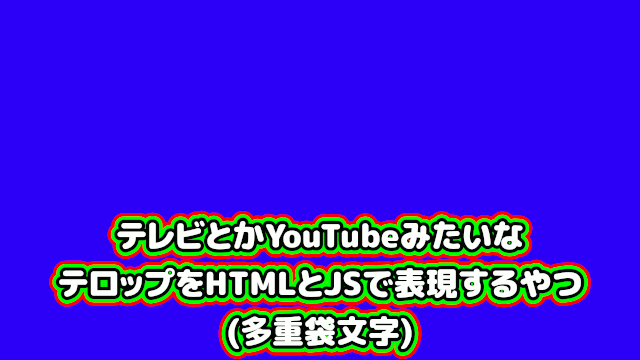

# telop-template-sample.mlt

  テレビとかYouTubeみたいな 
  テロップをHTMLとSVGとJSで表現するやつ 
  (多重袋文字)

  

---

[Shotcut](https://shotcut.org/)のテロップテンプレートとして利用しやすいmltプロジェクト。

- [htmlバージョン](https://ver-1000000.github.io/telop-template-sample/by-html.html)
- [svgバージョン](https://ver-1000000.github.io/telop-template-sample/by-svg.html)

---

[自家製フォント工房さんのMgen+ (ムゲンプラス)フォント](http://jikasei.me/font/mgenplus/)を利用する前提です。
